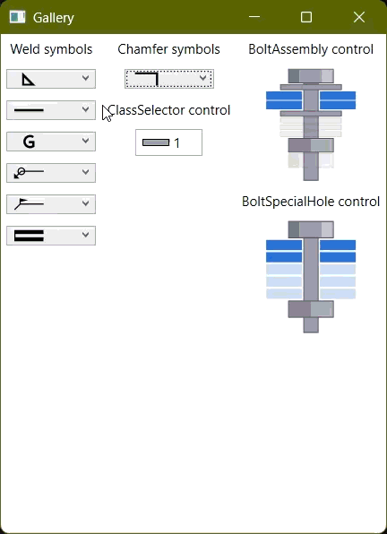
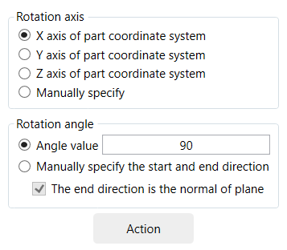
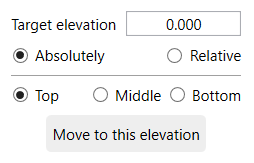
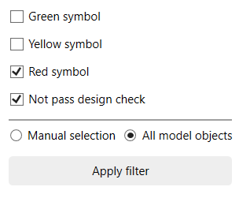
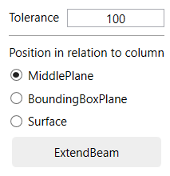

# Muggle TeklaStructures Extensions

Tools and plugins for Tekla Structures. Please use in accordance with the [Open Source License](LICENSE).

用于 Tekla Structures 的工具和插件。请遵守[开源协议](LICENSE)使用。

---

## Contents 目录

>Development Tools
>开发工具

- [Common](#common)
- [Common.WPF](#commonwpf)
- [CodingHelper](#codinghelper)

>Modeling Aids
>建模辅助工具

- [ShowModelObjectCoordinateSystem](#showmodelobjectcoordinatesystem)
- [SelectBooleans](#selectbooleans)
- [SelectWeldedModelObjects](#selectweldedmodelobjects)
- [ReorderContourPoints](#reordercontourpoints)
- [ShowContourOrder](#showcontourorder)
- [CopyWithDirection](#copywithdirection)
- [3DRotation](#3drotation)
- [MoveToElevation](#movetoelevation)
- [LocateToPrecisePosition](#locatetopreciseposition)
- [ConnectionStatusFilter](#connectionstatusfilter)
- [ExtendBeam](#extendbeam)

>Components
>组件

- [MG1001](#mg1001)

- [MG1002](#mg1002)

- [HJ1001](#hj1001)

- [WK1001](#wk1001)

- [MJ5001](#mj5001)

- [KJ1001](#kj1001)

- [KJ1002](#kj1002)

- [KJ2001](#kj2001)

---

## Common

Defines some practical types, methods, and rewrites of some officially implemented methods, e.g.,

定义了一些实用的类型、方法，以及对一些官方实现的方法进行了重写，例如：

- **Geometry3dOperation.PositionOfTriangleOnLines** method

  Find the position of a triangle in the 2D plane when its three vertices fall on three lines.

  求二维平面中三角形三个顶点分别落在三条直线上时的位置。

- **IntersectionExtension.LineToLine** method

  It is a rewrite of the official implementation of Intersection.LineToLine method, to solve the problem that in the case of two lines intersecting, the length of the line segment obtained by the official implementation is not equal to 0.0 (although the official document says that it is equal to 0.0, but it is actually a very small value).

  对官方实现 Intersection.LineToLine 方法的重写，解决在两直线相交的情况下，官方实现求得的线段长度不等于 0.0的问题（虽然官方文档说是等于 0.0，但实际是一个很小的值）。

- **IntersectionExtension.ArcToLine** method

  Which realizes to find the shortest line segment between a circular arc and a straight line in 3D space, and derives IntersectionExtension.CircleToLine method, which realizes to find the shortest line segment between a circle and a straight line in 3D space.

  实现求三维空间中圆弧与直线间最短线段，并引申出 IntersectionExtension.CircleToLine 方法，实现求三维空间中圆与直线间最短线段。

- **PointsInterval** class

  Provides a solution to solve the problems related to points interval.

  提供了一种求解点区间相关问题的解决方案。

- **VectorExtension.GetAngleBetween_Precisely** method

  It is a rewrite of the official implementation of Vector.GetAngleBetween method. The official method returns 0.0 for small angles, this method returns more accurate angles.

  是对官方实现 Vector.GetAngleBetween 的重写。官方实现对于一些比较小的角度，会按 0.0 返回，本方法可以返回更精确一些的角度。

- A series of **Transform** methods contained in **PointExtension** and **VectorExtension**

  Can be more convenient to transform in various transformation planes or coordinate systems.

  为 Point 和 Vector 扩展的一系列变换方法，可以更便捷地在各种变换平面或坐标系中进行转换。

- **ModelOperation.CreatStiffeners** method

  To easily create stiffeners for beams without nesting system component in your custom component (that will cause multiple symbols to appear).

  可方便地为梁创建加劲板，无须在节点中嵌套使用系统节点（会导致出现多个节点符号）。

- ...

See  [API Reference of Common\.chm](Common/Documents/API%20Reference%20of%20Common.chm) for more.

更多内容参见 [API Reference of Common\.chm](Common/Documents/API%20Reference%20of%20Common.chm)。

## Common.WPF

Contains some common **assets** (vector graphics), **user controls** and **value converters**.
For example, the SelectedIndex of the UpDirection ComboBox in the general tab of the system component is opposite to its corresponding attribute value "zsuunta", and **UpDirectionToSelectedIndexValueConverter** provides this conversion.

包含一些通用的**资产**（矢量图形）、**自定义控件**和**值转换器**。
例如，系统组件常规选项卡中的 UpDirection 组合框的 SelectedIndex 与其对应的组件参数值 "zsuunta" 是相反的，**UpDirectionToSelectedIndexValueConverter** 提供了这种转换。

  
  
Gallery

## CodingHelper

When creating custom components, it is usually necessary to manually write a large amount of code for component parameters (in PluginData class, Plugin class and ViewModel class) and apply attributes, which is tedious and time-consuming.

This analyzer is designed to solve this problem, containing source generators and corresponding diagnostics. It helps quickly generate code for component parameters, avoiding mismatches that may occur from manual coding, saving time, and allowing more focus on the core logic of the component.

通常在制作自定义组件时，总要手动为组件参数编写大量的代码（在 PluginData 类、Plugin 类和 ViewModel 类中）并添加上相关的特性，很繁重很浪费时间。

此分析器用于解决此问题，包含源生成器和与之配套的诊断器，有助于快速生成组件参数相关的代码，避免手动编写可能的失误导致不匹配，节约时间，有更多的精力关注于组件的核心逻辑。

How to use  [see here](CodingHelper/Readme.md).

如何使用 [参见这里](CodingHelper/Readme.md)。

## ShowModelObjectCoordinateSystem

## 显示模型零件坐标系

The macros "Show coordinate system" from Tekla Structures need to be started with a double click each time and can only be run once. This tool allows you to start it once and run several times. Useful for debugging.

软件自带的宏每次均需双击启动，且只能运行一次。本工具可以一次启动，多次点选并显示零件的坐标系。调试时很有用。

## SelectBooleans

## 选择布尔操作对象

Useful when modeling pipe truss, when there are many Boolean objects overlapped, it is difficult to select Boolean object of a part, this tool can be useful. Even if "Cuts and added material" and "Fittings" display are turned off in the view.

在管桁架建模时很有用，当有很多布尔操作对象重叠在一起时，要选中某一个零件的布尔操作对象很困难，此工具可派上用场，即使视图中关闭了“切割”或“末端对齐”显示也依然能够选中。

## SelectWeldedModelObjects

## 选择焊缝的焊接对象

Sometimes after creating a large number of weld, individual welds look strange, and it is hard to determine which two parts the weld is between, use this tool to solve this problem.

有时创建了大量的焊缝后，个别焊缝看起来很奇怪，又很难确定是哪两个零件之间的焊缝，使用此工具可解决此问题。

## ReorderContourPoints

## 重排多边形板轮廓点顺序

Not sure if this is a bug or not, but sometimes when you creat a contour plate, the actual order of the generated contour points is not the same as creating order.

In cases where the order is very important (for example, when defining sections), this tool can be used to specify the order.

不清楚是不是 BUG，有时候绘制多边形板时，实际生成的轮廓点顺序，并不是绘制时的顺序。

某些情况下顺序很重要时（比如定义截面时），则可以使用此工具指定顺序。

## ShowContourOrder

## 显示轮廓点顺序

Display the sequence of contour points using numbers.

用编号显示轮廓点顺序。

## CopyWithDirection

## 带基点和方向复制

Suitable for situations that require batch copying with rotation, avoiding the tedious process of copying first and then rotating each one individually.

适用于需要批量复制且带有旋转的情形，避免先复制再一个个旋转角度的繁琐操作。

## 3DRotation

## 三维旋转

Offers more options than the rotation commands provided by the system.

比系统提供的旋转命令多一些选项。

## MoveToElevation

## 移动到指定标高

Easily move model objects to a specified elevation; you can specify the target elevation as top elevation, center elevation, or bottom elevation, and you can also specify whether it is a global elevation or a relative elevation.

You can start the command first and then select the model objects, or you can select the model objects first and then start the command.

便捷地移动模型对象到指定标高，可指定目标标高是顶标高、中心标高或底标高，还可指定是全局标高或相对标高。

可以先启动命令，再选择模型对象；也可先选择模型对象，再启动命令。

## LocateToPrecisePosition

## 重定位到精确的位置

During the modeling process, columns and beams sometimes have slight deviations (such as a length of 5999.99, etc.) that can be corrected using this tool. It is especially suitable for frame structures.

You can select the columns and beams first, and then execute the command; or you can execute the command first and then select the columns and beams.

建模过程中，柱梁有时会有一些微小的偏差（如长度为 5999.99 等），可用此工具修复。特别适用于框架结构。

可先选中柱梁，再执行命令；也可先执行命令再选择柱梁。

## ConnectionStatusFilter

## 组件状态过滤

The selection filter provided by the system cannot filter the state of components, this tool can solve that problem.

系统提供的选择过滤无法过滤组件的状态，此工具可解决该问题。

## ExtendBeam

## 延伸梁

The three extension tools provided by the system are not very convenient. This tool only requires selecting the beams that need to be extended, and they will automatically extend to nearby column (three options: 'middle plane', 'bounding box plane', 'surface') or beam (non-optional: 'middle plane').

You can first select the beams that need to be extended and then execute the command; or you can execute the command first and then select the beams that need to be extended.

系统提供的三款延伸工具不是很方便，此工具仅需选择要进行延伸的梁，即可自动进行延伸到附近的柱（三个选项：“中心平面”、“包围框”、“表面”）或梁（非可选项：“中心平面”）。

可先选中需延伸的梁，再执行命令；也可先执行命令，再选择需延伸的梁。

## MG1001

### Portal frame structure series connection - vertical connection between portal frame side column and beam

### 门刚系列节点 - 门刚边柱与梁竖向连接

The feature is that it can automatically adjust the column height according to the end plate size. Custom components (within the software, not defined using the API) cannot do this and require manual adjustment of the column height.

特点是可以根据端板尺寸自动调整柱高度。参数化自定义组件（软件内定义，不是使用 API 定义）做不到这一点，需要手动调整柱高。

## MG1002

### Portal frame structure series connection - horizontal connection between portal frame middle column and two beams

### 门刚系列节点 - 门刚中柱与梁横向连接

Suitable for portal frame middle column with uniform or symmetric variable cross-section connect with uniform or tapered beams.

适用于门刚结构等截面或对称变截面中柱，与等截面或楔形梁横向连接。

## HJ1001

### Truss structure series connection - circular tube butt joint

### 桁架系列节点 - 圆管对接

The feature is applicable to curved beams (creat using "CurvedBeam" or "PolyBeam" command). Custom components can only be used for connecting straight beams and are not suitable for curved beams.

特点是对曲线梁，即用 CurvedBeam (曲梁)或 PolyBeam (多边形梁)绘制的梁也适用。参数化组件只能用于直线梁对接，对于曲线梁无法胜任。

## WK1001

### Latticed shell structure series connection - square tube member connection

### 网壳系列节点 - 方管杆件连接

The feature can automatically adjust the normal direction of members. (Currently, this function can only be activated from the main interface; starting from the component catalog will not adjust the normal direction.)

It can also automatically determine the diameter of the connecting tube based on the specified minimum clearance.

特点是可以自动调整杆件的法向。（目前只能从主界面启动实现此功能，从组件目录启动不会调整法向）

也可以根据指定的最小净间距自动确定连接筒的直径。

## MJ5001

### Embedded part - embedded part at the end of H-beam

### 埋件 - H型梁端头埋件

Applicable to the connection between the end of H-beam steel and concrete.

适用于H型钢梁端头与混凝土连接。

## KJ1001

### Frame structure series connection - connection between box column and H-beam

### 框架系列节点 - 箱型柱与H型钢连接

Includes three types of connections: 1. Flange welding, web bolting; 2. Welded short beam, fully bolted; 3. Welded short beam, flange welding, web bolting.
**Known issue: Welding preparation cannot be applied to non-orthogonal beams (referring to left-right skew, up-down tilt does not affect), otherwise it will cause the model to disappear**

包含三种连接形式：1. 翼缘焊接，腹板栓接; 2. 焊短梁，全栓接; 3. 焊短梁，翼缘焊接，腹板栓接。
**已知问题：焊接准备不能作用于非正交梁(指左右歪斜，上下倾斜不影响)，否则会造成模型消失**

## KJ1002

### Frame structure series connection - lateral restraint of beam flange

### 框架系列节点 - 钢梁翼缘侧向约束

Applicable to lateral restraint of H-beam steel girders.

适用于H型钢梁侧向约束。

## KJ2001

### Frame structure series detail - box column with external column base

### 框架系列细部 - 箱型柱外包柱脚

Anchor bolts, exterior studs, internal diaphragm.

柱脚锚栓，外侧栓钉，内部隔板。

